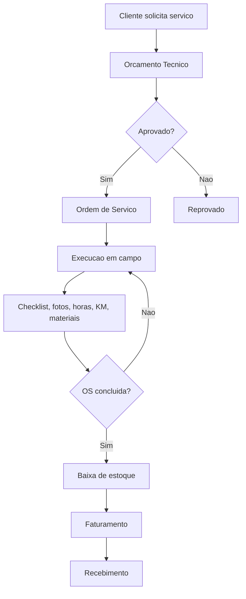

# Arquitetura Funcional

## Principio

O Engeletra ERP deve reaproveitar o maximo possivel do ERPNext:

- `Customer` para clientes.
- `Item`, `Warehouse` e `Stock Entry` para estoque.
- `Sales Invoice` e `Payment Entry` para financeiro.
- `Employee` e `User` para tecnicos e equipe.
- `File` para fotos, documentos e anexos.

DocTypes personalizados ficam restritos ao dominio vertical da Engeletra.

## Fluxo principal

## Extensoes planejadas

- Gestao de obras contratadas.
- Centro de custo por obra.
- Frota, manutencao e motoristas.
- Relatorios tecnicos de transformadores.
- Ensaios eletricos estruturados.
- Migracao de planilhas legadas.
- Portal do cliente.
- Aplicativo/PWA para tecnico em campo.
